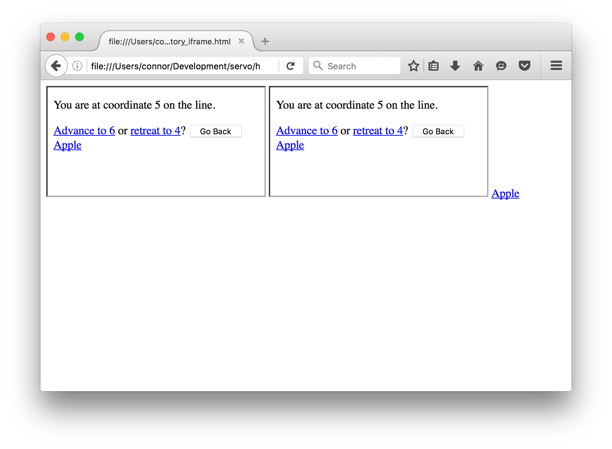
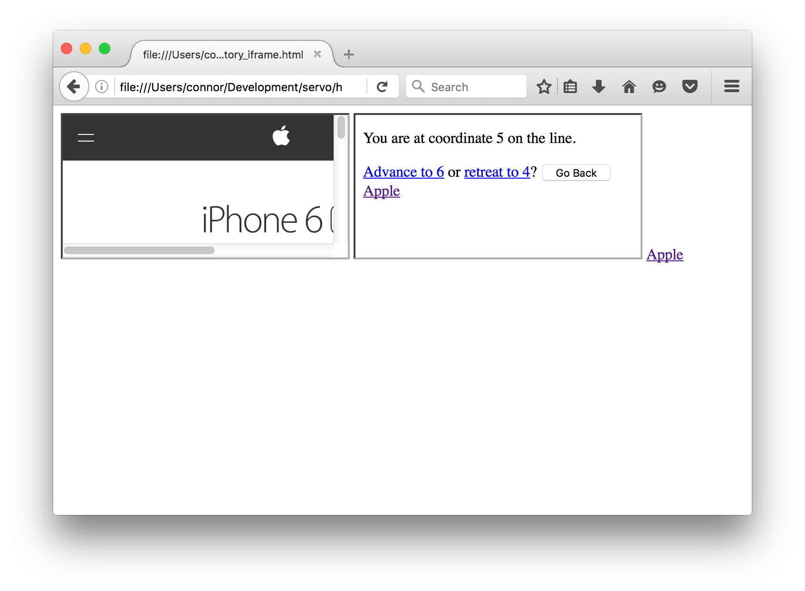
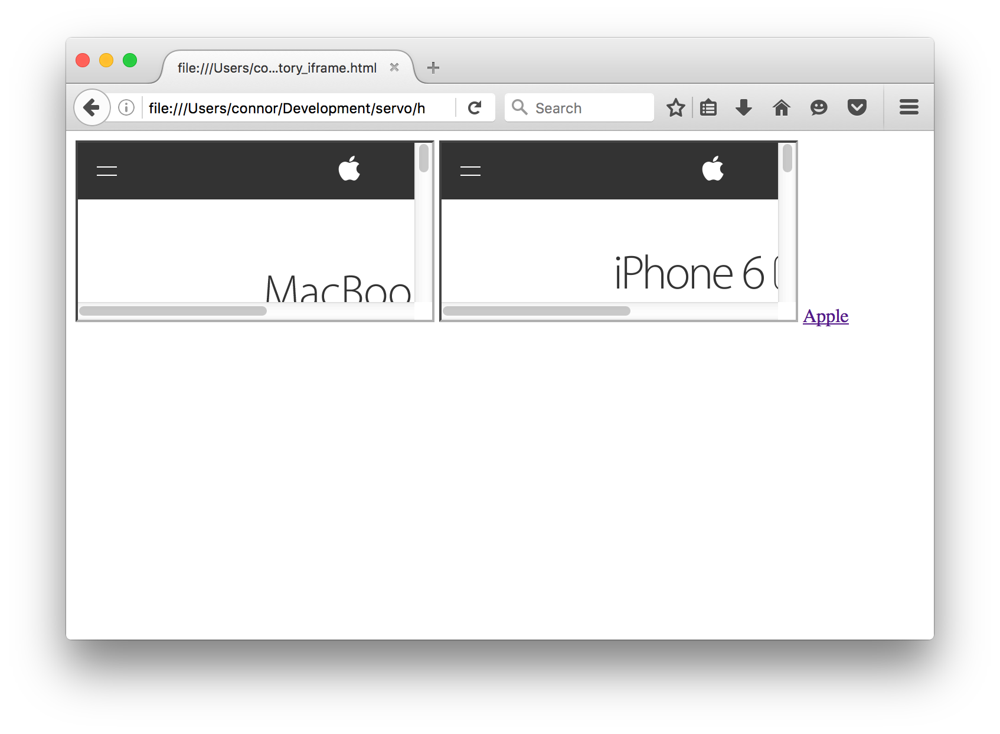
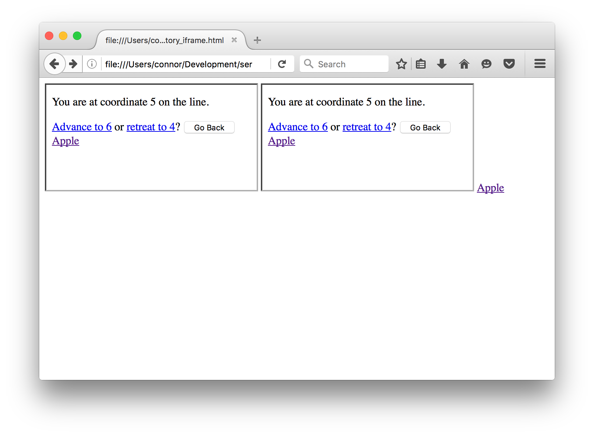

# Servo Navigation Proposal
### Terminology
 - **Frame**: A web page including pages in iframes. Stores session history.

 The session history for a `Frame` is stored in 3 parts
  1. `prev`: A `Vec` containing the entries that were added before `current`
  2. `current`: The active `entry` for this `Frame`
  3. `next`: A `Vec` containing the entries that were added after `current`

 - **Frame entry**: A recorded navigation stored by `Frame`.

  The **entry** stores the `PipelineId` that should be activated when the entry is navigated to. It also stores the time at which the entry was added to its `Frame` and the time at which the `Frame` was navigated from (This will happen when `Frame::load` is called). If this entry is new and has not been navigated from, the navigated from time is set to `None`.

 - **Frame Tree**: A tree of all active Frames accessible from a single root Frame.

 - **Full Frame Tree**: A frame tree that includes all frames accessible from a single root frame. This includes Frames that are not fully active.

  The **full frame tree** is the tree that is used to construct the **Joint Session History**. This disagrees with the spec, but the other browser implementations use a **full frame tree**.

 - **Joint Session History**: The union of the all the Frame entries in a full frame tree

 - **History Iterator**: Iterates over the **joint session history**.

 - **Navigation Direction**: This is an enum that stores a direction: `Forward` or `Back` and an unsigned integer representing the delta to navigate in that direction.

### Joint Session History
The **joint session history** is the union of the `Frame` entries ordered chronologically. The Servo implementation will use a lazily generated iterator to act as the **joint session history** called the `HistoryIterator`.

### History Iterator
The `HistoryIterator` is generated based on 2 parameters: the _root frame_ and the _navigation direction_.

Steps for creation of the `HistoryIterator`:
1. Get the **full frame tree** starting from the _root frame_.
2. Iterate through each `Frame` in the **full frame tree**.
  1. Get an iterator over `frame.prev` or `frame.next` depending on the _navigation direction_.
  2. Reverse the iterator and make it `Peekable`.
3. Collect all of the iterators and `FrameId`.
4. Create the `HistoryIterator` by passing in the collected iterators as the `stack` and the _navigation direction_ as the direction.

History Iterator `next` algorithm:
1. Peek on each of the iterators stored on the stack for their next entry.
2. Determine which `Frame` should navigate:
  - If the navigation direction is `Forward`:
    1. Find the entry that has the lowest time for when the entry was added to its `Frame`
  - If the navigation direction is `Back`:
    1. Find the entry that has the highest time for when that entry was navigated from.
3. Pop the iterator from the `Frame` that was determined should be navigated and return the popped entry.

### Navigation By a Delta
Steps for navigating by a delta:
1. Find the _root frame_ from the given `PipelineId`.
  - Search upward through the frame tree until you hit the root `Frame` or, if mozbrowser is enabled, a mozbrowser `Frame`.
1. Construct a `HistoryIterator` from the _root frame_ and _navigation direction_.
2. Get _delta_ from the _navigation direction_
3. Find the `nth(delta)` entry of the `HistoryIterator`. This is the _specified entry_.
4. Run the **jump to time** algorithm on each `Frame` in the **full frame tree**.
  - If _navigation direction_ is forward, pass the the time the entry was added to its `Frame` and pass the _navigation direction_.
  - If _navigation direction_ is back, pass the the time the entry was navigated from to its `Frame` and pass the _navigation direction_.

### Frame
Steps for running **jump to time** algorithm:
- If the _navigation direction_ is `Forward`:
  1. If `frame.next` is empty, abort these steps.
  2. If the time the current entry was navigated from is greater than the passed in _time_ or is `None`, abort these steps.
  3. Iterate through the `next` vector and find the first frame that has the time it was added to its `Frame` greater than _time_ or is `None`.
  4. Activate that entry and move all the entries in between (including `frame.current`) to `frame.prev`.

- If the _navigation direction_ is `Back`:
  1. If `frame.prev` is empty, abort these steps.
  2. If the time the current entry was added to this `Frame` is less than the passed in _time_, abort these steps.
  3. Iterate the the `prev` vector and find the first entry that the time it was added to this `Frame` is less than _time_.
  4. Activate that entry and move all the entries in between (including `frame.current`) to `frame.next`.

### Example Scenarios

Example frame layout:
```
/-------------------------\
| /---------\ /---------\ |
| | Frame 1 | | Frame 2 | |
| |_________| |_________| |
|                         |
| Frame 0                 |
|_________________________|
```
Base state (`PipelineId` is omitted as they do not matter here):

Entry is of the form: `(time added to frame, time navigated from)`
```
Frame 0: {
  prev: [],
  current: (3, None),
  next: [],
}
Frame 1: {
  prev: [],
  current: (2, None),
  next: [],
}
Frame 2: {
  prev: [],
  current: (1, None),
  next: [],
}
```

**Backward Navigation**

Frame 1 navigates:
```
Frame 1: {
  prev: [(2, Some(4))],
  current: (4, None),
  next: [],
}
```
Frame 2 navigates:
```
Frame 2: {
  prev: [(1, Some(5))],
  current: (5, None),
  next: [],
}
```
Navigate `Back(1)`

Peek on each of the `Frame`'s `prev`:
```
Frame 1: (2, Some(4))
Frame 2: (1, Some(5))
```
Compare the time each entry was navigated from.

Frame 2 navigated last, so we return that frame and entry and **jump to time** at 5.

(Note: if we compare the times the entry was added, we would pick the incorrect entry as Frame 2 was the last `Frame` to navigate, not Frame 1)

Also the full joint session history going back would look like: `[(1, Some(5)), (2, Some(4))]`

**Jump to time**

Each `Frame` will now navigate `Back` to the time `5`.

* **Frame 0**: `frame.prev` is empty so this is a no-op
* **Frame 1**: The time the current entry was added to the frame, `4` is less than `5`. no-op
* **Frame 2**: The time the current entry was added to the frame, `5` is not less than `5`. Find the first entry in `prev` that the time it was added to the Frame is less than `5` and activate it.

Final state:
```
Frame 0: {
  prev: [],
  current: (3, None),
  next: [],
}
Frame 1: {
  prev: [(2, Some(4))],
  current: (4, None),
  next: [],
}
Frame 2: {
  prev: [],
  current: (1, Some(5)),
  next: [(5, None)],
}
```

**Forward Navigation**

State (same as before except navigated back again):

```
Frame 0: {
  prev: [],
  current: (3, None),
  next: [],
}
Frame 1: {
  prev: [],
  current: (2, Some(4)),
  next: [(4, None)],
}
Frame 2: {
  prev: [],
  current: (1, Some(5)),
  next: [(5, None)],
}
```

Navigate `Forward(1)`

Look at each `Frame`'s next vector.
```
Frame 1: (4, None)
Frame 2: (5, None)
```
Compare the times at which each entry was added to the `Frame` and pick the oldest one.

Entry `(4, None)` is picked.

Frame 1 and the entry is returned.

**Jump to time**

Each `Frame` will now navigate `Forward` to the time `4`.

* **Frame 0**: `frame.next` is empty so this is a no-op
* **Frame 1**: The time the current entry was navigated from, `4` is not greater than `4`, so we find the next entry that the time it was navigated from is either greater than `4` or is `None` and activate that entry.
* **Frame 2**: The time the current entry was navigated from, `5` is greater than `4`. no-op

Final state:
```
Frame 0: {
  prev: [],
  current: (3, None),
  next: [],
}
Frame 1: {
  prev: [(2, Some(4))],
  current: (4, None),
  next: [],
}
Frame 2: {
  prev: [],
  current: (1, Some(5)),
  next: [(5, None)],
}
```

### Other Browsers
I have conducted some tests using other browsers to see how they handle navigation history.
I will use a simple webpage that uses `pushState` and `popState` as well as links to external websites. The page will consist of 1 page containing 2 iframes.

#### FireFox

**Does FF use full frame tree or just the active frame tree?**

Base State:


Click `Apple` on first iframe.


Click `Apple` on second iframe.


Click `Apple` on main page.


Run `history.go(-3)`.


Since this navigated both iframes back (neither of which were active) I believe that FF uses a **full frame tree** and not just the active frame tree.

**TODO:** add more tests
